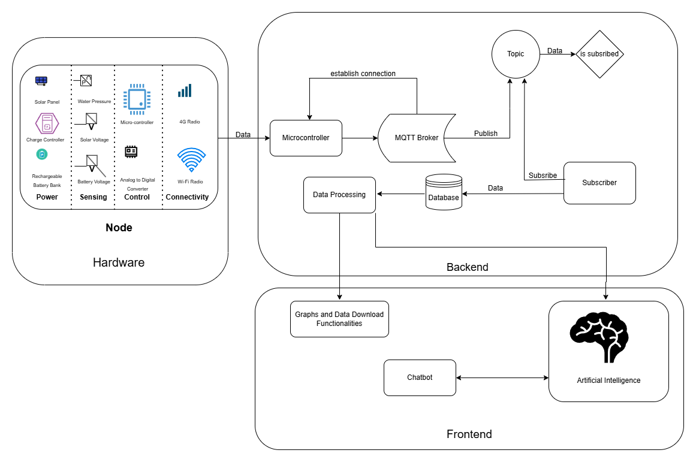
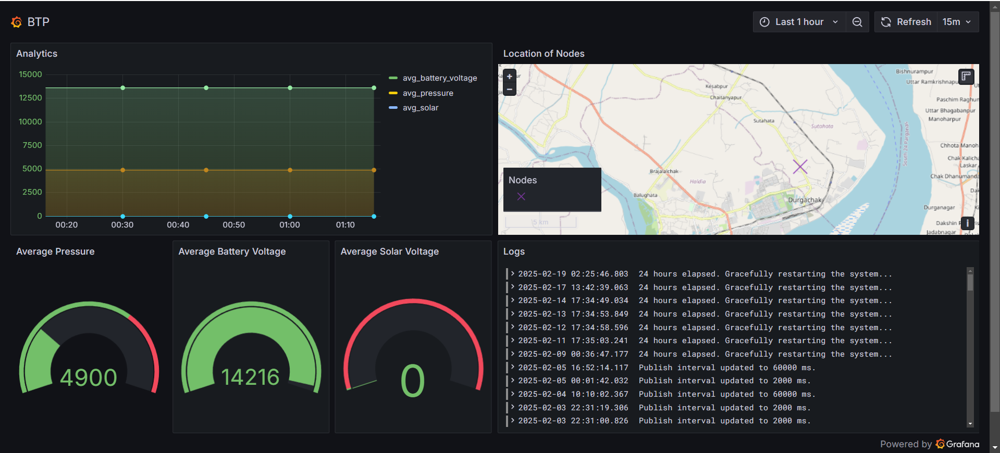
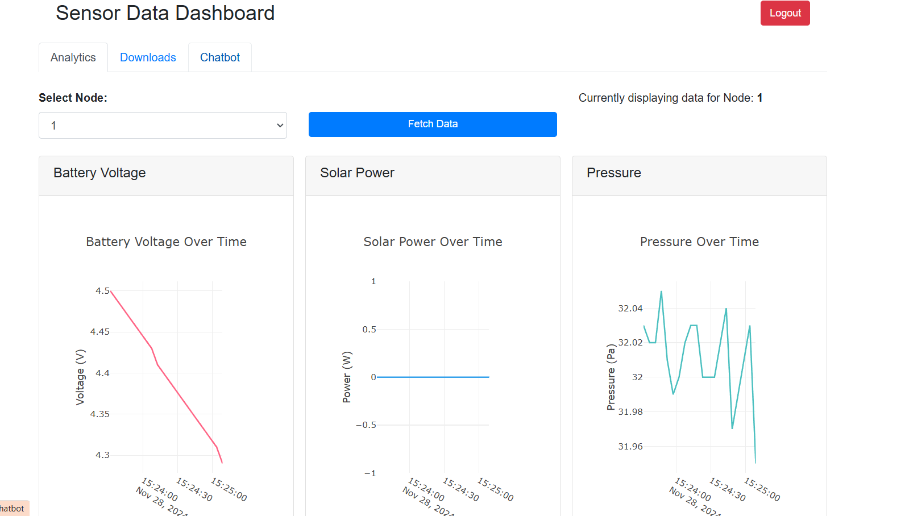
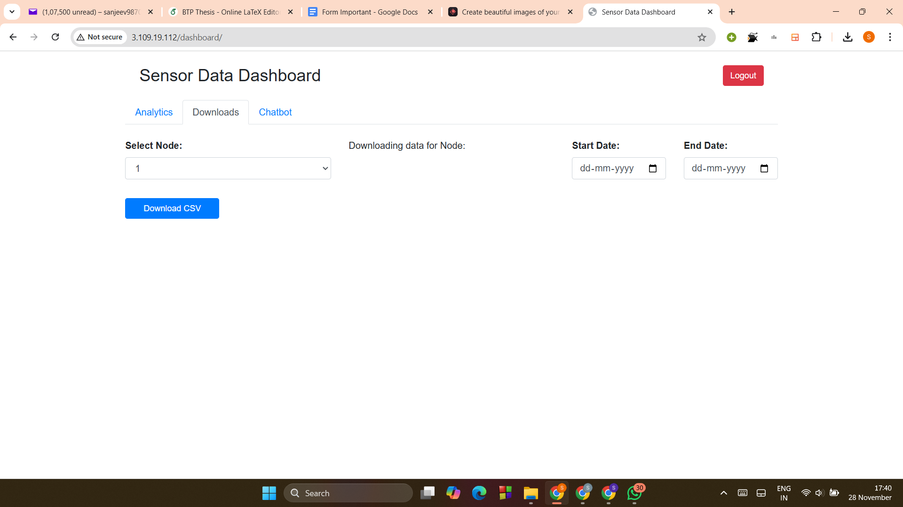
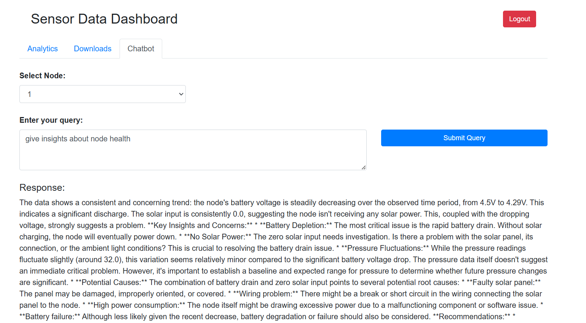

# 🌐 BTP-Final-FullStack

 <!-- Relative path to the banner image -->

🚀 **Deployed FullStack Project Link**: [BTP-Final-FullStack](http://3.109.19.112/)

🚀 **Deployed Graphana Project Link**: [Dashboard](https://suryanshkgp.grafana.net/public-dashboards/ff35f2650b0b4022a30ad68b3561e975?var-nodeid=$__all&orgId=1)

---
## 📖 Overview

BTP-Final-FullStack is a full-stack web application built with **Django** for the backend and modern frontend technologies. The project showcases robust backend development, responsive frontend, and a scalable deployment pipeline. 

---
## 🔥 Features

✨ **Core Highlights**:
- **Dynamic Graphana Dashboard** .
- **Dynamic Web Pages** served by Django templates.
- **Secure User Authentication** with Django's built-in authentication system.
- **RESTful APIs** using Django REST Framework (DRF).
- **Real-Time Updates** 
- **Scalable Deployment** on AWS EC2.

---

## 📽️ Pictures

Here’s a quick preview of the application in action:
### 🎬 Graphana
 <!-- Replace with your GIF -->

### 🎬 Home Dashboard
 <!-- Replace with your GIF -->

### 🎬 Data Download Dashboard
 <!-- Replace with your GIF -->

### 🎬 Chatbot Interface
 <!-- Replace with your GIF -->

---

## 🛠️ Tech Stack

### Backend:
- **Django** 
- **Django REST Framework (DRF)** - For building APIs.
- **MySQL** - Database solutions.

### Frontend:
- **React.js** / Django Templates 
- **CSS/Bootstrap** for styling.

### Deployment:
- **AWS EC2** - Hosting.
- **Gunicorn & Nginx** - For serving Django applications.
- **Django Static Files Management**.

---

## ⚙️ Setup and Installation

Follow these steps to set up the project locally:

### Installation

1. **Clone the repository**
   ```bash
   git clone https://github.com/your-username/BTP-Final-FullStack.git
   cd BTP-Final-FullStack

 📂 Backend Setup
## Create a virtual environment
    python -m venv env
    source env/bin/activate  # For Windows: env\Scripts\activate

## Install dependencies
    pip install -r requirements.txt

## Apply migrations
    python manage.py migrate

## Start the Django development server
    python manage.py runserver
